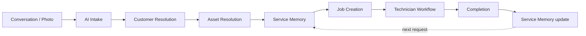
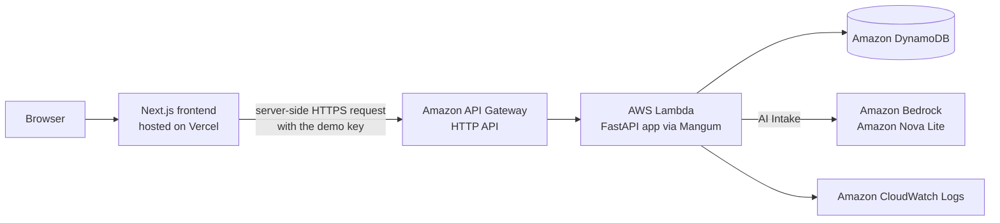
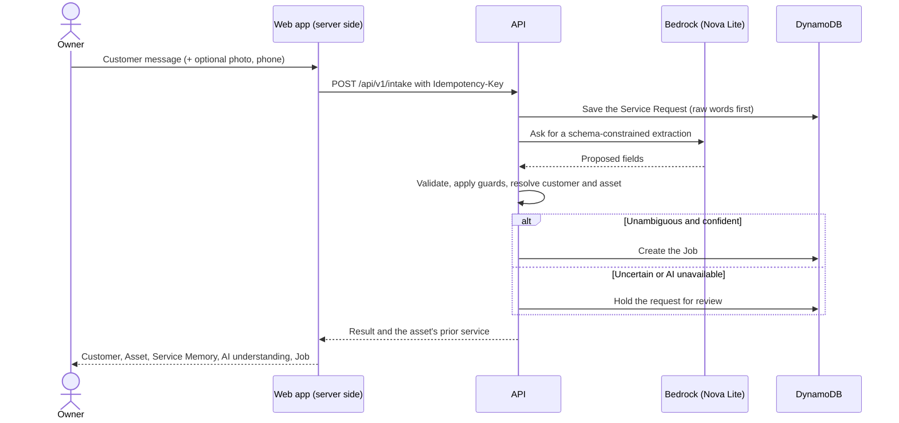
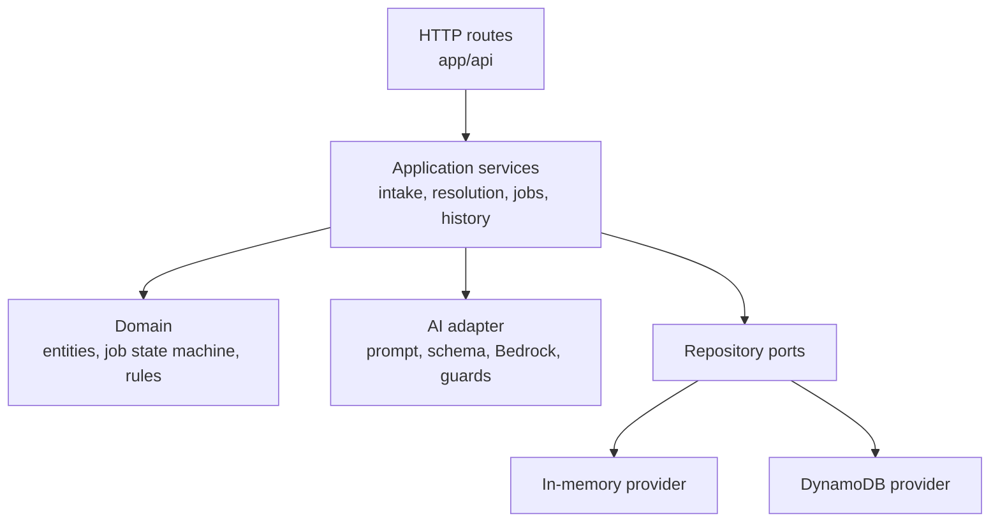

# KaamSetu

> **Give local service businesses a memory.**

**Live Demo:** https://kaam-setu-eta.vercel.app/

This is the currently deployed KaamSetu frontend. It talks to a backend running on AWS (see [Running the deployed demo](#17-running-the-deployed-demo)) and uses only fictional data.

KaamSetu turns messy customer conversations into structured service jobs, keeps the history of every customer and every appliance, and helps small service businesses run their work without depending on WhatsApp threads, notebooks, spreadsheets or one person's memory.

Small local service businesses (AC and appliance repair, electricians, plumbers, water-purifier and computer technicians) mostly run on conversations. A request arrives as a WhatsApp message, a phone call or a photo. The owner reads it, remembers who the customer is and which appliance they mean, writes a job down somewhere, and tells a technician. Along the way the important context gets lost: which of the customer's two air conditioners this is about, what was done to it last time, whether the message mentioned sparks or a burning smell.

KaamSetu starts where that data is actually created: the conversation. An AI Intake step reads the message and proposes a structured Service Request. Application code then decides which Customer and which Asset it refers to, using recorded evidence rather than the model's guess, recalls what was previously done to that Asset, and creates a Job. When the system is not sure, it stops and asks a person. Completed work becomes a Service Event, which is added to the appliance's **Service Memory**, so the next complaint from the same customer starts with the history already in front of the owner and the technician.

This is **Conversation → Work**, not another form-based field-service or CRM tool that assumes the data already exists in neat fields.

## Project status

KaamSetu was built for the **WeMakeDevs × AWS First Commit** hackathon (September 17–20, 2026). The end-to-end workflow is implemented and deployed.

| Area | Status |
|---|---|
| Backend API | Implemented (Python, FastAPI): customers, assets, technicians, jobs and their lifecycle, service requests, service history, AI intake |
| AI Intake | Implemented with Amazon Nova Lite on Amazon Bedrock: schema-validated extraction, deterministic customer and asset resolution, safety wording guard |
| Persistence | Amazon DynamoDB when deployed; DynamoDB Local or an in-memory store for local development |
| Web app | Implemented (Next.js): job board, AI intake, review of held requests, job detail, customers and appliances with Service Memory, technician queue |
| Demo data | Deterministic, idempotent seed of a fictional business covering five demo scenarios |
| Deployment | Backend on AWS (API Gateway, Lambda, DynamoDB, Bedrock, CloudWatch) via an AWS SAM template; frontend on Vercel |
| Tests | Backend pytest suite (700+ tests) and frontend unit tests (Node's built-in test runner) |

Some things are deliberately out of scope for this version, notably real authentication, WhatsApp and voice input, photo storage and AI diagnosis. See [Current limitations](#20-current-limitations).

## Contents

1. [Problem Statement](#1-problem-statement)
2. [Our Solution](#2-our-solution)
3. [Core Features](#3-core-features)
4. [Examples](#4-examples)
5. [Why KaamSetu](#5-why-kaamsetu)
6. [Target Users and Applications](#6-target-users-and-applications)
7. [Architecture](#7-architecture)
8. [AI Architecture](#8-ai-architecture)
9. [Technology Stack](#9-technology-stack)
10. [Repository Structure](#10-repository-structure)
11. [Requirements](#11-requirements)
12. [Local Setup](#12-local-setup)
13. [Windows Setup](#13-windows-setup)
14. [Linux Setup](#14-linux-setup)
15. [Environment Variables](#15-environment-variables)
16. [Demo Data](#16-demo-data)
17. [Running the deployed demo](#17-running-the-deployed-demo)
18. [AWS Deployment](#18-aws-deployment)
19. [Security](#19-security)
20. [Current Limitations](#20-current-limitations)
21. [Future Directions](#21-future-directions)
22. [Hackathon Context](#22-hackathon-context)
23. [License and Attribution](#23-license-and-attribution)
24. [Demo Flow](#24-demo-flow)

---

## 1. Problem Statement

A small service business rarely receives work as structured data. It receives it as conversation, and the gap between the conversation and a well-run job is filled by whoever is on the phone.

- **Requests are unstructured.** "Bhaiya LG AC phir se thanda nahi kar raha. Kal 5 ke baad aa sakte ho?" is a complete request to a human and an unusable one to a form. Messages mix languages, leave out the model number, and carry the schedule in a half-sentence.
- **Customer identity is ambiguous.** The same person writes from different numbers, and two customers can share a first name.
- **One customer, many appliances.** A household has two air conditioners, a refrigerator and a water purifier. "The AC is not cooling" does not say which one.
- **Technicians lack context.** The person who visits often does not know what was done last time, or that this is the second complaint.
- **Repeat complaints need memory.** Recognising that an appliance was serviced 45 days ago is valuable, and it currently lives in someone's head.
- **Safety wording gets lost.** "Sparks", "burning smell" and "current lag raha hai" are buried in a long message and can be read past.
- **Owners re-type everything.** Every conversation is manually turned into a job, again, by hand.
- **Chat tools keep no operational memory.** WhatsApp is where the conversation happens, but it does not know which appliance a thread is about or what was done to it.

KaamSetu does not replace WhatsApp or established field-service platforms. It addresses the step before them: turning what customers actually write into work, and remembering what was done.

## 2. Our Solution

KaamSetu is an **unstructured-first service management** system. The starting point is the customer's own words (and optionally a photo). Everything else is derived from them, checked, and recorded.



Four kinds of information are kept apart on purpose, because mixing them is how systems end up trusting a guess:

| Layer | What it is | Where it lives | Who decides it |
|---|---|---|---|
| **Raw customer words** | Exactly what the customer wrote | Stored unchanged on the Service Request | Nobody: it is preserved |
| **AI interpretation** | A proposal: appliance, problem, symptoms, urgency, preferred time, confidence, what is missing, and where each field came from | Stored on the Service Request with the model id and prompt version | The model proposes; it is validated and labelled as AI-generated |
| **Structured operational state** | Customer, Asset, Job, Technician, status | Records in the database | Deterministic application code, or a person |
| **Persistent service history** | What was actually done, by whom, with what parts | Service Events, attached to the Asset | Written only when a job is completed |

Keeping these apart means the AI can be wrong without the business being wrong: the words are never overwritten, the interpretation is never treated as fact, records are only attached on evidence, and history only contains work that was really recorded.

## 3. Core Features

Everything below is implemented in this repository.

### AI Service Intake

A customer's message (and an optional photo) becomes a structured, schema-validated extraction: intent, type of work, customer reference, appliance type, brand and model, the problem as reported, symptoms, urgency, preferred date and time, per-group confidence, what information is missing, and a per-field record of where each value came from (stated, inferred, from the photo). Anything the customer did not say stays unknown; nothing is guessed to fill a field. By default extraction runs with a 12-second timeout and one retry, both configurable. If the model is unavailable or answers invalidly, the request is kept exactly as written and falls back to manual entry. Submitting the same message twice with the same `Idempotency-Key` returns the first result and does not create a second job or call the model again. A photo is shown to the model and then discarded; it is not stored.

### Customer Resolution

The model may mention a name, but it never picks a record. A customer is treated as existing only on explicit evidence: an operator-selected customer, or a phone number that matches exactly one customer. A name on its own only produces candidates for a person to confirm. Otherwise the customer is new, ambiguous or unresolved.

### Asset Resolution

An appliance is matched only among the already-identified customer's own appliances, and only automatically when exactly one of them fits what was said. If two fit (two air conditioners, no brand named), the request is held for a person.

### Service Memory

Each Asset keeps its own history of Service Events, newest first: the work performed, technician notes, parts used, symptoms observed and whether a follow-up was needed. It is shown when a request arrives, on the job, on the customer page and on the technician's job card. It is exact history for one appliance, not a search over free text, and it is always labelled as recorded work, not a diagnosis of the current problem.

### Job Management

A job is created without a person only when the request is a service request, the type of work is known, a problem was described, the customer and the appliance both resolved to existing records, and the model's overall confidence is at least 0.7. Otherwise a person reviews it. Every job originates from a Service Request, and job creation is idempotent.

### Technician Workflow

Jobs move through `NEW → ASSIGNED → SCHEDULED → ON_THE_WAY → IN_PROGRESS → COMPLETED`, with `CANCELLED` reachable before completion. `SCHEDULED` and `ON_THE_WAY` can be skipped. Assignment requires an active technician and can be changed until work starts. Scheduling requires a time. The API enforces the state machine; the UI only suggests the next step. `COMPLETED` is reachable only through the completion action, which records the Service Event, the job change and an audit record together. A separate technician view shows a mobile-first queue with the customer, appliance, time, the appliance's recorded service, and only the moves a technician can make.

### Safety Handling

Wording that suggests danger (sparking, burning or burnt smell, smoke, electric shock, fire, short circuit, exposed wiring, gas smell, melting, and common Hinglish spellings such as *chingari* and *jalne*) is detected by deterministic code, independent of the model. It can only raise urgency to `safety_critical`; it never lowers anything. The customer's wording is preserved as the job description, the job is marked prominently on the board and on the job, and KaamSetu gives no repair advice and makes no diagnosis.

### Human-in-the-loop Review

When KaamSetu will not decide (ambiguous customer, ambiguous appliance, new customer, new appliance, low confidence, or AI unavailable) the request is saved and appears in a review queue. A person confirms the customer, then the appliance, then creates the job. Each step commits on its own, the state lives in the URL, and a phone number that already belongs to a customer cannot be reused for a new one.

### Completion and Service History

Completing a job stores work performed, notes, parts, observed symptoms and a follow-up flag as a Service Event on the Asset. The next request for that appliance sees it. Job changes also write audit records.

### Web application

| Screen | Purpose |
|---|---|
| Job board | Every status, safety-critical jobs pinned, requests waiting for review |
| New request | Paste a message and see customer, appliance, Service Memory, AI understanding and job in order |
| Review request | Confirm the customer and appliance for a held request, then create the job |
| Job detail | Progress, the customer's words next to what the AI read, actions, and the appliance's memory |
| Customers | Each customer's appliances, each with its own Service Memory |
| Technicians | Workload, and a mobile-first queue with lifecycle actions |

## 4. Examples

The fields shown depend on what the model can extract from the message. These are real outcomes from the seeded demo dataset, described conceptually.

### A repeat complaint

Message from phone `90000 20001`:

> Bhaiya LG AC phir se thanda nahi kar raha. Kal 5 ke baad aa sakte ho?

| | Result |
|---|---|
| Customer | Ravi Kumar, matched because the phone number belongs to exactly one customer |
| Asset | His LG air conditioner, matched by type and brand among his own appliances |
| Problem | "AC is not cooling again", as reported (wording varies by run) |
| Preferred time | The next day from 5 PM, read in the business timezone |
| Model number | Not stated, so it stays unknown |
| Service Memory | Two recorded services on this appliance (a gas refill and an annual service); the refrigerator's history is not mixed in |
| Job | Created with status `NEW`; a person assigns a technician and the job moves through the lifecycle |

### An ambiguous request

Message from a customer who owns two air conditioners (an LG and a Samsung):

> AC thanda nahi kar raha

The customer is recognised by phone number, but both air conditioners fit, so KaamSetu does not pick one. No job is created. The request appears in the review queue with both appliances as candidates. A person chooses, sees that appliance's Service Memory, and confirms. If the customer had said "LG AC not cooling properly", the brand would have selected the LG unit directly. A message from an unknown number, such as a new customer asking about a Godrej refrigerator, is held the same way: the customer and appliance are marked new, and a person adds them before a job exists.

### A safety-critical request

> Fridge se chingari nikal rahi hai aur jalne ki smell aa rahi hai

Deterministic wording detection marks the request `safety_critical`. The job description stays the customer's report, the job is pinned in a safety panel on the board and flagged on the job and the technician card, and no diagnosis or repair instruction is produced.

## 5. Why KaamSetu

> Most service software assumes structured data already exists. KaamSetu starts where the data is actually created: the conversation.

- **Unstructured-first.** The input is a message in whatever language and shape the customer used, not a form the customer must fill.
- **Conversation → Work.** The output is a job with a customer, an appliance and context, not a transcript to read.
- **Customer and asset identity.** A request is attached to a specific customer and a specific appliance, or held until a person decides.
- **Service Memory.** History belongs to the appliance, so a repeat complaint arrives with what was done before.
- **Human confirmation when uncertain.** The system asks rather than invents.

Messaging apps are where these conversations already happen, and general-purpose CRM and field-service tools organise customers, jobs and schedules that a person has already entered. KaamSetu is meant to work alongside both by covering the step in between.

## 6. Target Users and Applications

The primary user, as described in the product requirements, is the owner or dispatcher of a small home or appliance service business with roughly 1–20 technicians ([docs/PRD.md](docs/PRD.md)). The data model and demo are built around appliance and equipment service, where the same customer owns several serviceable assets over time.

Intended application areas (these describe where the approach fits, not existing customers):

- AC repair and service
- Refrigerator and appliance repair
- Washing machine service
- Electricians and plumbers
- RO and water purifier technicians
- Computer and printer repair
- CCTV installers and other equipment installers
- Maintenance contractors and other small field-service businesses

The appliance types currently modelled are: air conditioner, refrigerator, washing machine, microwave, television, water purifier, computer, printer, electrical, plumbing, other, and unknown. The repository does not define a pricing or commercial model.

## 7. Architecture

### Deployed architecture



- The browser only ever talks to the Next.js app. The Next.js **server** (Server Components for reads, Server Actions for changes) calls the API and adds the `X-Demo-Key` header from a server-side environment variable. The key is never sent to the browser, and there is no generic proxy route. The API does not enable CORS, so a web page cannot call it directly.
- **AI handles language.** The model reads the message and proposes structured fields.
- **Deterministic code handles truth.** The backend validates, resolves customers and assets, generates ids, persists records, enforces state transitions and idempotency, writes audit records, and decides access.

### How an intake flows



### Inside the API



The same FastAPI application runs locally under Uvicorn and on AWS Lambda. Only the persistence provider and the configuration change between environments. Every repository call is scoped to a business, so records of one business cannot be read through another.

### API at a glance

All routes are under `/api/v1`; request bodies never carry a business id.

| Group | Routes |
|---|---|
| Health | `GET /health` (open) |
| Customers and assets | `POST/GET /customers`, `GET /customers/{id}`, `POST/GET /customers/{id}/assets`, `GET /assets/{id}` |
| Technicians | `POST/GET /technicians`, `GET /technicians/{id}` |
| Jobs | `POST/GET /jobs`, `GET/PATCH /jobs/{id}`, `POST /jobs/{id}/assign`, `/transition`, `/complete` |
| History | `GET /assets/{id}/history`, `GET /customers/{id}/history` |
| Intake and review | `POST /intake`, `GET /service-requests`, `GET /service-requests/{id}`, `POST /service-requests/{id}/job` |

More detail is in [services/api/README.md](services/api/README.md).

## 8. AI Architecture

The rule is simple: **the model proposes; the application decides.** The model never writes to the database, never picks a record, and never changes a job.

| Responsibility | Handled by |
|---|---|
| Understanding a message in natural language (English, Hinglish and mixed text were used in the demo) | AI model |
| Extracting structured fields (appliance, problem, symptoms, urgency, preferred time, confidence, what is missing, provenance) | AI model, constrained by a JSON Schema |
| Reading an attached photo as additional context | AI model (photos are not stored) |
| Validating the model's output against the schema | Application code |
| Dropping past dates, raising urgency for safety wording | Application code (deterministic guards) |
| Deciding which customer and which appliance a request refers to | Application code |
| Creating records, generating ids, state transitions, idempotency, audit records | Application code |
| Access control and tenant scoping | Application code |
| Composing the Service Event summary at completion | Application code (no AI summarisation) |

**Model.** KaamSetu uses **Amazon Nova Lite** (`amazon.nova-lite-v1:0`) through Amazon Bedrock. The call forces a single tool call whose input is the extraction schema, at temperature 0. The model is chosen by configuration (`LLM_MODEL`); the application code is model-agnostic and only the Bedrock adapter knows the provider. Only the Bedrock provider is implemented.

**Structured output.** The extraction schema is defined once in typed code and exported as JSON Schema ([ai/schemas/intake_extraction.v1.json](ai/schemas/intake_extraction.v1.json)); a test fails if the two drift. The prompt is versioned, and the model id and prompt version are recorded on every extraction. Values the customer did not give must stay unknown.

**Untrusted input.** Customer messages are treated as data, never as instructions. The prompt tells the model to ignore instructions inside a message, and its output is validated before anything is used. The deployment smoke test includes hostile text.

**Human in the loop.** *When the system is uncertain, it should ask rather than invent.* Ambiguous, new or low-confidence cases become review items, and confidence scores are shown, but they are informational: Nova Lite often reports high confidence, so they are never the only safeguard.

**Model notes.** Nova Lite sometimes writes the string `"null"` where JSON `null` is required. The adapter repairs exactly that and nothing else, only at fields the schema declares nullable, and any other invalid answer is retried once and then falls back to manual entry. Details are in [ai/README.md](ai/README.md).

**What is not done.** There is no model fine-tuning, no agent framework, no AI diagnosis, no AI-written summaries, and no published accuracy benchmark. An evaluation dataset is planned but not included.

## 9. Technology Stack

| Category | Technology |
|---|---|
| Frontend | Next.js 16 (App Router, Server Components and Server Actions), React 19, TypeScript (strict), Tailwind CSS 4, lucide-react, ESLint; Geist fonts via `next/font` |
| Backend | Python, FastAPI, Pydantic v2, pydantic-settings, Uvicorn, Mangum (FastAPI on Lambda), boto3 |
| AI | Amazon Bedrock, Amazon Nova Lite (`amazon.nova-lite-v1:0`) |
| Data | Amazon DynamoDB (deployed), DynamoDB Local (optional, local), in-memory store (tests and quick start) |
| Cloud (AWS) | API Gateway (HTTP API), Lambda, DynamoDB, Bedrock, CloudWatch Logs, IAM, AWS SAM / CloudFormation |
| Frontend hosting | Vercel |
| Testing and quality | pytest, httpx, moto (DynamoDB), ruff; `node:test` for frontend logic; `tsc`, ESLint |
| Development | Git and GitHub; Docker (for DynamoDB Local); SAM CLI (for deployment) |

## 10. Repository Structure

```text
KaamSetu/
├── apps/
│   └── web/                     Next.js web application
│       ├── src/app/             Routes: board, intake, requests, jobs, customers, technicians
│       ├── src/components/      UI components (board, intake, memory, review, job, technicians, ui)
│       ├── src/lib/             Server-only API client, view models, formatting and pure logic (+ unit tests)
│       └── scripts/             local-stack.sh: throwaway local backend for UI work
├── services/
│   └── api/                     Python / FastAPI backend
│       ├── app/
│       │   ├── api/             HTTP routes, response envelope, error mapping
│       │   ├── ai/              Extraction schema, prompt, Bedrock adapter, guards
│       │   ├── core/            Configuration, ids, clock, request context
│       │   ├── domain/          Entities, job state machine, repository ports
│       │   ├── services/        Intake, resolution, jobs, history, scheduling
│       │   └── providers/       Persistence adapters: in-memory and DynamoDB
│       ├── seed/                Deterministic demo dataset and verifier
│       ├── scripts/             Lambda packaging
│       └── tests/               Unit and integration tests
├── ai/                          Generated JSON Schema for the intake extraction, and AI notes
├── infrastructure/
│   ├── aws/                     SAM template, deploy script, smoke test
│   └── local/                   Placeholder notes (no local infrastructure code yet)
├── data/
│   └── evaluation/              Placeholder for a future evaluation dataset (no data yet)
├── docs/                        Product requirements, hackathon notes, AI tool disclosure
├── .env.example                 Backend configuration template
└── README.md
```

Further documentation: [Product requirements](docs/PRD.md) · [API](services/api/README.md) · [Demo dataset](services/api/seed/README.md) · [AWS deployment](infrastructure/aws/README.md) · [Web app](apps/web/README.md) · [AI notes](ai/README.md) · [AI tool disclosure](docs/AI-TOOLS.md) · [Hackathon checklist](docs/HACKATHON-COMPLIANCE.md). The [implementation plan](docs/IMPLEMENTATION-PLAN.md) is the original roadmap: parts of it (an agent framework, OpenSearch retrieval, a local model provider and attachment storage) were not built for this version.

## 11. Requirements

### Local development

| Tool | Needed for | Version |
|---|---|---|
| Git | Cloning | Any recent version |
| Python | Backend | 3.12 or newer (developed and deployed on 3.14) |
| pip | Backend dependencies | Bundled with Python |
| Node.js and npm | Frontend | Node 20.9 or newer is required by Next.js; the frontend unit tests run TypeScript directly and need a recent Node (22.18 or newer; developed on Node 26) |
| Docker | Optional: DynamoDB Local, to run with the seeded dataset | Any recent Docker |
| An AWS account with Bedrock access to Amazon Nova Lite | Optional: real AI intake when running locally | See [Environment Variables](#15-environment-variables) |

You can run the whole app without Docker or AWS. In that mode the backend keeps data in memory, AI is off, and every request goes through manual review.

### AWS deployment (optional)

An AWS account and CLI profile allowed to create CloudFormation, IAM, Lambda, API Gateway, DynamoDB, CloudWatch Logs and S3 resources; access to the Bedrock model you configure; the [AWS SAM CLI](https://docs.aws.amazon.com/serverless-application-model/latest/developerguide/install-sam-cli.html); `make`; Python 3 with pip; and a Unix shell for `deploy.sh`. Docker is not required. See [AWS Deployment](#18-aws-deployment).

### Operating systems

The backend and frontend are cross-platform. Linux instructions are in [section 14](#14-linux-setup) and Windows (PowerShell) instructions in [section 13](#13-windows-setup). The Windows commands were written from the repository's configuration and have not been run on a Windows machine.

## 12. Local Setup

These steps use a Unix-style shell (Linux; see [section 13](#13-windows-setup) for PowerShell). There are two ways to run the backend:

- **Quick start (no Docker, no AWS).** In-memory data, AI disabled. The board starts empty and requests are created through manual review.
- **Full local demo.** DynamoDB Local holds the seeded demo dataset. Add Bedrock credentials if you also want real AI intake.

### 1. Clone

```bash
git clone https://github.com/Arjun13-git/KaamSetu.git
cd KaamSetu
```

### 2. Install and configure the backend

```bash
cd services/api
python3 -m venv .venv
source .venv/bin/activate
pip install -e '.[dev]'
cp ../../.env.example .env
```

The template selects `APP_ENV=development`, in-memory data and no AI, which is the quick start. `.env` is ignored by git; never commit real values.

### 3. Start the backend

```bash
uvicorn app.main:create_app --factory --reload
```

It listens on `http://127.0.0.1:8000`. Check it:

```bash
curl http://127.0.0.1:8000/api/v1/health
# {"data":{"status":"ok","version":"0.1.0"},"request_id":"req_..."}
```

### 4. Install and configure the frontend

In a second terminal, from the repository root:

```bash
cd apps/web
npm install
cat > .env.local <<'EOF'
KAAMSETU_API_URL=http://127.0.0.1:8000/api/v1
KAAMSETU_DEMO_KEY=
KAAMSETU_TIMEZONE=Asia/Kolkata
EOF
```

`.env.local` is ignored by git. These are **server-side** variables: never prefix the key with `NEXT_PUBLIC_`, and never commit it. In `development` mode the backend does not require a key, so it can stay empty.

### 5. Start the frontend

```bash
npm run dev
```

### 6. Open the app

Open http://localhost:3000. If port 3000 is taken, start with `npm run dev -- -p 3100` and open that port instead.

### 7. Verify it works

- The top bar shows **Live · API v0.1.0**. If it says *API unreachable*, check `KAAMSETU_API_URL` and that the backend is running.
- On **New request**, submit any message. With AI disabled the result says the AI could not read it, saves the request, and offers **Review and create the job**. Adding a customer and appliance there and confirming creates a job on the board.

### Full local demo (seeded data)

Run DynamoDB Local, load the demo dataset, and start the backend against it:

```bash
docker run -d --name kaamsetu-ddb -p 127.0.0.1:8100:8000 amazon/dynamodb-local:latest \
  -jar DynamoDBLocal.jar -inMemory -sharedDb

cd services/api && source .venv/bin/activate
export AWS_ACCESS_KEY_ID=local AWS_SECRET_ACCESS_KEY=local AWS_REGION=us-east-1   # dummy values; DynamoDB Local accepts any
export DATA_PROVIDER=dynamodb DYNAMODB_TABLE=kaamsetu DYNAMODB_ENDPOINT_URL=http://127.0.0.1:8100
python -m seed --create-table        # loads and verifies the demo dataset
APP_ENV=development uvicorn app.main:create_app --factory --reload
```

Restart the frontend if it was already running. To get real AI intake, replace the dummy credentials with your own AWS profile and add `LLM_PROVIDER=bedrock`, `LLM_MODEL=amazon.nova-lite-v1:0` and `AWS_PROFILE=<your-profile>`. That uses Amazon Bedrock in your account. DynamoDB Local is in-memory here, so stopping the container clears the data; run the seed again to restore it.

### Run the checks

```bash
# backend (from services/api, venv active)
pytest
ruff check .
ruff format --check .

# frontend (from apps/web)
npm run typecheck
npm run lint
npm test
npm run build
```

`npm run dev` may rewrite `apps/web/next-env.d.ts` and generate `apps/web/AGENTS.md`. These are generated by Next.js, so leave them out of your commits.

## 13. Windows Setup

Use **PowerShell**. WSL is not required.

**1. Install the tools.** Install [Git for Windows](https://git-scm.com/download/win), [Python 3.12 or newer](https://www.python.org/downloads/windows/) (tick *Add python.exe to PATH*), and [Node.js LTS](https://nodejs.org/) (which includes npm). Docker Desktop is only needed for the seeded demo. Open a new PowerShell and check `git --version`, `python --version` and `node --version`.

**2. Clone.**

```powershell
git clone https://github.com/Arjun13-git/KaamSetu.git
cd KaamSetu
```

**3. Backend: install and configure.**

```powershell
cd services\api
py -3 -m venv .venv
.\.venv\Scripts\Activate.ps1
python -m pip install -e ".[dev]"
Copy-Item ..\..\.env.example .env
```

If activation is blocked, run `Set-ExecutionPolicy -Scope Process RemoteSigned` first and try again.

**4. Start the backend.**

```powershell
uvicorn app.main:create_app --factory --reload
```

Check it from another PowerShell window with `Invoke-RestMethod http://127.0.0.1:8000/api/v1/health`.

**5. Frontend: install, configure, start.** In a second PowerShell, from the repository root:

```powershell
cd apps\web
npm install
@"
KAAMSETU_API_URL=http://127.0.0.1:8000/api/v1
KAAMSETU_DEMO_KEY=
KAAMSETU_TIMEZONE=Asia/Kolkata
"@ | Set-Content .env.local
npm run dev
```

Open http://localhost:3000. As in [section 12](#12-local-setup), do not commit `.env.local` and never use `NEXT_PUBLIC_` for the key.

**Seeded demo on Windows (optional).** With Docker Desktop running:

```powershell
docker run -d --name kaamsetu-ddb -p 127.0.0.1:8100:8000 amazon/dynamodb-local:latest -jar DynamoDBLocal.jar -inMemory -sharedDb

cd services\api
.\.venv\Scripts\Activate.ps1
$env:AWS_ACCESS_KEY_ID = "local"; $env:AWS_SECRET_ACCESS_KEY = "local"; $env:AWS_REGION = "us-east-1"
$env:DATA_PROVIDER = "dynamodb"; $env:DYNAMODB_TABLE = "kaamsetu"; $env:DYNAMODB_ENDPOINT_URL = "http://127.0.0.1:8100"
python -m seed --create-table
$env:APP_ENV = "development"
uvicorn app.main:create_app --factory --reload
```

`apps/web/scripts/local-stack.sh` and `infrastructure/aws/deploy.sh` are Bash scripts. On Windows, run them from Git Bash or WSL, or use the manual commands above.

## 14. Linux Setup

The commands in [section 12](#12-local-setup) are Linux commands and run unchanged. Only installing the prerequisites differs by distribution.

**Debian / Ubuntu**

```bash
sudo apt update
sudo apt install -y git python3 python3-venv python3-pip curl
```

**Fedora**

```bash
sudo dnf install -y git python3 python3-pip curl
```

**Arch**

```bash
sudo pacman -S --needed git python python-pip nodejs npm curl
```

Things that commonly differ:

- **Python 3.12 or newer is required.** Some LTS releases ship an older `python3` (Ubuntu 22.04 has 3.10). Install a newer interpreter through your distribution, `pyenv` or `uv`, and create the virtual environment with it (for example `python3.12 -m venv .venv`).
- **Node.js.** Distribution packages are often older than Next.js 16 needs (20.9+). Install a current LTS from [nodejs.org](https://nodejs.org/), NodeSource, or a version manager such as `nvm`.
- **Debian and Ubuntu** package `venv` separately (`python3-venv`, included above).
- **Docker** (only for the seeded demo): install Docker Engine following its documentation for your distribution, and add your user to the `docker` group or use `sudo`.

After that, follow [section 12](#12-local-setup) from step 1. As a shortcut for UI work, `apps/web/scripts/local-stack.sh up` starts DynamoDB Local, loads the seed and runs the API in demo mode on port 8101 with a local-only key; the values to put in `apps/web/.env.local` are listed in [apps/web/README.md](apps/web/README.md). `LLM=disabled` keeps it fully offline, and `local-stack.sh down` stops it.

## 15. Environment Variables

Never commit real values. `.env` and `.env.local` are ignored by git. Only put placeholders in the repository.

### Backend (`services/api`, read from the environment or `.env`)

| Variable | Purpose | Example | Required |
|---|---|---|---|
| `APP_ENV` | `development` and `test` accept the fixed development identity with no credentials; `demo` accepts it only with the demo key; `production` accepts no caller. Unset means `production` (fails closed) | `development` | Yes for local use |
| `DATA_PROVIDER` | `memory` or `dynamodb`. `memory` is refused when `APP_ENV` is `demo` or `production` | `memory` | No (default `memory`) |
| `DYNAMODB_TABLE` | Table name when using DynamoDB | `kaamsetu` | With `dynamodb` |
| `DYNAMODB_ENDPOINT_URL` | Local DynamoDB endpoint. Leave empty for real AWS | `http://127.0.0.1:8100` | Local DynamoDB only |
| `AWS_REGION` | AWS region for DynamoDB and Bedrock | `us-east-1` | For AWS and DynamoDB Local |
| `AWS_PROFILE` | AWS CLI profile used for real AWS calls | `my-profile` | For real AWS or Bedrock |
| `LLM_PROVIDER` | `bedrock` or `disabled` (`ollama` is accepted by the setting but not implemented). Anything other than `bedrock` means manual entry | `disabled` | No (default `disabled`) |
| `LLM_MODEL` | Bedrock model id | `amazon.nova-lite-v1:0` | With `bedrock` |
| `AI_TIMEOUT_SECONDS` | Timeout for one model attempt (up to 25) | `12` | No |
| `AI_MAX_RETRIES` | Retries after an invalid or failed answer (0 to 2) | `1` | No |
| `DEFAULT_TIMEZONE` | Timezone for reading relative dates like "kal" | `Asia/Kolkata` | No (default `UTC`) |
| `DEV_BUSINESS_ID`, `DEV_ACTOR_ID` | The fixed server-side identity used in development, test and demo | `bus_demo`, `usr_dev` | No |
| `DEMO_API_KEY` | Shared key for `APP_ENV=demo`, at least 32 characters, sent as `X-Demo-Key`. Set it in the deployment environment | *(generate your own)* | Only for `demo` |
| `APP_NAME`, `LOG_LEVEL` | Application name and log level | `kaamsetu`, `INFO` | No |

`.env.example` also lists `OBJECT_STORAGE_PROVIDER` and `SEARCH_PROVIDER`. They are placeholders and nothing reads them yet.

### Local development only (standard AWS SDK variables)

| Variable | Purpose | Example | Required |
|---|---|---|---|
| `AWS_ACCESS_KEY_ID`, `AWS_SECRET_ACCESS_KEY` | Dummy values for DynamoDB Local, which accepts any credentials. Use a real profile instead for Bedrock | `local`, `local` | DynamoDB Local without a profile |

### Frontend (`apps/web/.env.local`, server-side only)

| Variable | Purpose | Example | Required |
|---|---|---|---|
| `KAAMSETU_API_URL` | Base URL of the API including `/api/v1`, no trailing slash | `http://127.0.0.1:8000/api/v1` | Yes |
| `KAAMSETU_DEMO_KEY` | The API's demo key, sent as `X-Demo-Key` by server code. Leave empty against a development-mode API. Never expose it to the browser | *(empty locally)* | Only if the API runs in `demo` mode |
| `KAAMSETU_TIMEZONE` | IANA timezone used to show times and to read "today" | `Asia/Kolkata` | No (default `Asia/Kolkata`) |

### Deployment script only (`infrastructure/aws/deploy.sh`)

| Variable | Purpose | Example | Required |
|---|---|---|---|
| `AWS_PROFILE`, `AWS_REGION` | Profile and region to deploy with | `my-profile`, `us-east-1` | Yes |
| `KAAMSETU_STACK_NAME` | CloudFormation stack name | `kaamsetu-demo` | No |
| `KAAMSETU_BEDROCK_MODEL_ID` | Bedrock model id passed to the stack | `amazon.nova-lite-v1:0` | No |
| `KAAMSETU_SAM`, `PYTHON`, `KAAMSETU_DEMO_KEY_FILE` | Path to `sam`, the Python used to build, and where the generated demo key is kept | | No |

## 16. Demo Data

**Why.** A memory product needs history to show. The seed creates a small, fully fictional service business (four technicians, seven customers, twelve appliances, fourteen service requests, thirteen jobs across every status, six service events and their audit records) so the whole loop can be demonstrated immediately. Every name, address and phone number (`90000 xxxxx`) is invented.

**Seed it** (needs a DynamoDB table; see [Full local demo](#full-local-demo-seeded-data)):

```bash
cd services/api
python -m seed --create-table     # local endpoint only: create the table, load, then verify
python -m seed                    # load (idempotent), then verify what is stored
python -m seed --verify           # read-only: verify only, write nothing
python -m seed --manifest         # print every id and scenario; needs no database
```

**Guarantees.**

- **Deterministic.** Records are built from one fixed instant using the real domain workflow, with readable, stable ids (for example `cus_demo_ravi_kumar`). Two loads produce the same fingerprint, and a test pins it.
- **Idempotent and resumable.** Each write first checks whether it was applied, so running it again writes nothing and never undoes later changes; an interrupted load is completed, not duplicated.
- **Honest.** The two AI-intake requests in the dataset carry hand-written readings labelled `seed-fixture`. The UI shows them as "Seeded example", never as AI output.
- **Verifiable.** `--verify` checks counts, the five scenarios and record integrity against what is actually stored. Once people use the demo it reports differences, which is its purpose. To reset, delete the items and load again.

**The five scenarios** (send each with the phone number shown; the web app has one-click demo messages):

| # | Scenario | Message (phone) | Expected outcome |
|---|---|---|---|
| 1 | Repeat AC complaint with history | "Bhaiya LG AC phir se thanda nahi kar raha. Kal 5 ke baad aa sakte ho?" (`90000 20001`) | Existing customer and appliance; a job; prior service shows exactly the LG AC's two recorded services |
| 2 | Multiple assets | "AC thanda nahi kar raha" (`90000 20003`) | Two candidate appliances; held for review; "LG AC not cooling properly" selects the LG |
| 3 | New customer | "Namaste, mera naam Deepak hai. Mere Godrej fridge ka compressor start nahi ho raha. Indiranagar mein hoon. Kal aa sakte ho?" (`90000 29999`) | New customer and appliance; no job until a person confirms |
| 4 | Safety-critical | "Fridge se chingari nikal rahi hai aur jalne ki smell aa rahi hai" (`90000 20004`) | Flagged `safety_critical`; the customer's wording kept |
| 5 | Technician and job lifecycle | Jobs in every status | Assign, schedule, start and complete a job; its appliance's history gains an event. The inactive technician cannot be assigned |

Full details are in [services/api/seed/README.md](services/api/seed/README.md).

## 17. Running the deployed demo

The live frontend is **https://kaam-setu-eta.vercel.app/**. It is a Next.js app whose server code calls the KaamSetu API on AWS (API Gateway, Lambda, DynamoDB, Bedrock). There is no sign-in: the server holds the shared demo key and acts as the demo business.

- It runs against the fictional demo dataset. Please use only fictional data.
- Actions are real. Submitting a request calls Amazon Nova Lite, and creating jobs, assigning technicians and completing work write to a shared demo database.
- The API is throttled (10 requests per second steady, burst 20), so rapid repeated actions may be rejected briefly.
- The demo key is not published and never reaches your browser.

To try it, follow the [Demo Flow](#24-demo-flow).

## 18. AWS Deployment

The backend is deployed as a single AWS SAM stack defined in [infrastructure/aws/template.yaml](infrastructure/aws/template.yaml).

| AWS service | Role |
|---|---|
| Amazon API Gateway (HTTP API) | Public entry point, throttled, no CORS |
| AWS Lambda | One function (`python3.14`, x86_64, 1024 MB, 28 s timeout) running the FastAPI app via Mangum |
| Amazon DynamoDB | On-demand table with global secondary indexes, the source of truth |
| Amazon Bedrock | Amazon Nova Lite for AI Intake; the role may invoke only the configured model |
| Amazon CloudWatch Logs | Function logs (14-day retention by default) |
| AWS IAM | Execution role limited to `GetItem`, `PutItem` and `Query` on the table and its indexes, and `InvokeModel` on the one configured model |
| AWS CloudFormation / SAM | Deploys the stack. The SAM CLI also creates an S3 bucket to hold the uploaded package; the application does not store data in S3 |

Deployment is scripted, not automatic. With the prerequisites from [Requirements](#11-requirements):

```bash
AWS_PROFILE=<profile> AWS_REGION=<region> infrastructure/aws/deploy.sh
```

The script builds the package, deploys the stack `kaamsetu-demo`, generates the demo key on the first run (kept outside the repository and passed to CloudFormation as a hidden parameter), and prints the outputs including the API URL. Then verify and load demo data:

```bash
python infrastructure/aws/smoke_test.py <ApiUrl>          # walks the vertical slice against the live API

cd services/api
AWS_PROFILE=<profile> AWS_REGION=<region> DATA_PROVIDER=dynamodb \
  DYNAMODB_TABLE=<TableName> python -m seed               # load and verify the demo dataset
```

The smoke test leaves labelled records behind, which must be removed before loading demo data. To remove everything: `aws cloudformation delete-stack --stack-name kaamsetu-demo` (this deletes the table and its data).

**Frontend.** The frontend is a standard Next.js app. The repository contains no Vercel-specific configuration file. Set `KAAMSETU_API_URL` (the stack's `ApiUrl` plus `/api/v1`), `KAAMSETU_DEMO_KEY` and `KAAMSETU_TIMEZONE` as **server-side** environment variables on the hosting platform, and do not use `NEXT_PUBLIC_` names for them.

More detail, including known limits, is in [infrastructure/aws/README.md](infrastructure/aws/README.md).

## 19. Security

KaamSetu is a hackathon demo, and its security is designed for a demo with synthetic data. It is not production-grade authentication.

**What is in place**

- **The demo key stays on the server.** The web app reads it only in server-only modules; a client component that imports them fails the build. It is not a `NEXT_PUBLIC_` variable, it is not in the browser bundle, and browsers do not call the API directly.
- **Access control on the API.** In `demo` mode a request needs the shared key, compared in constant time and required to be at least 32 characters. A valid key acts as one fixed demo business and cannot choose a tenant. An unconfigured API (`APP_ENV` unset) accepts no caller.
- **Tenant scoping.** The business identity is decided server-side and never read from a header, query string or body; bodies that carry a business id are rejected. Every repository call is scoped to a business.
- **Least-privilege IAM.** The Lambda role can read and write only the one table and invoke only the one configured Bedrock model, with no wildcards.
- **Validation everywhere.** Requests and the model's output are validated against strict schemas; the job state machine and the rule that `COMPLETED` is reachable only through completion are enforced on the server; writes that must be atomic are; retried requests are idempotent.
- **Untrusted input.** Customer text and photos are treated as data. Photos are type- and size-checked, shown to the model, and not stored.
- **Human review** for ambiguous, new or low-confidence records, so nothing is silently attached to the wrong customer or appliance.
- **Safety wording is preserved** and surfaced, never diagnosed.
- **Throttling** on the API (10 requests per second, burst 20) and structured error responses that do not expose stack traces.

**Demo limitations**

- The shared key is a stand-in for real authentication. Anyone with the frontend link acts as the demo business; there are no user accounts, roles or per-user identity.
- The deployed function keeps the key as an environment variable, readable by anyone in that AWS account who can read the function's configuration.
- The demo table has no point-in-time recovery and is deleted with the stack.
- Do not use real customer data with this deployment.

## 20. Current Limitations

- **Authentication.** Demo access with a shared key only. There is no user identity, role model or per-user permission system, and the technician view has no login.
- **Input channels.** Text, plus one optional photo, entered in the web app. There is no WhatsApp integration and no voice input.
- **Attachments.** Photos are shown to the model and then discarded, so they are not kept on the request or job. Completion photos and other attachments are not supported.
- **Service Memory** is exact history for one appliance. There is no semantic or free-text search over history.
- **AI.** One provider (Bedrock) and one model (Nova Lite). It sometimes misformats optional fields (repaired narrowly), and its confidence scores are not a reliable signal on their own. Language coverage was exercised informally with English and Hinglish messages. No accuracy benchmark or evaluation dataset is included. There is no AI diagnosis and no AI-written summaries.
- **Safety detection** relies on a fixed wording list (see [Safety Handling](#safety-handling)) plus whatever urgency the model assigns. It is a prompt to look, not a guarantee.
- **Out of scope by design:** payments, invoicing or accounting, GPS or live technician tracking, route optimisation, marketplace features, inventory, autonomous pricing or parts ordering.
- **API and UI gaps.** No endpoint to dismiss a held request, no job activity timeline, no push updates (the board polls), and customer and appliance creation are not idempotent on the server (the UI guards against double submits).
- **Scale and platform.** Single fixed demo business; API throttled to 10 requests per second; Lambda timeout of 28 s covering up to two model attempts.
- **Placeholders in the repository.** `infrastructure/local` and `data/evaluation` contain notes only. A local model provider, OpenSearch and an agent framework are not implemented.

## 21. Future Directions

These are ideas, not implemented features.

- Voice intake and richer multilingual handling
- WhatsApp integration
- Photo and attachment storage, including completion photos
- Semantic retrieval over service history
- Real authentication and roles
- Technician recommendation from skills and availability
- A customer portal
- Recurring service reminders
- Analytics and reporting
- Route planning
- A published evaluation dataset and accuracy measurements
- A local or open-source model provider

## 22. Hackathon Context

KaamSetu was built for **WeMakeDevs × AWS First Commit** (Bharat Builds Tour), **September 17–20, 2026**. The project was built during the hackathon window, and AWS services are used in the deployed architecture: Amazon Bedrock (Amazon Nova Lite) for AI Intake, Lambda and API Gateway for the API, DynamoDB for data, and CloudWatch Logs for logging. The event rules are linked from [docs/HACKATHON-COMPLIANCE.md](docs/HACKATHON-COMPLIANCE.md).

**AI coding tools.** As recorded in [docs/AI-TOOLS.md](docs/AI-TOOLS.md), the project used Claude Code (implementation assistance, debugging, refactoring, test generation) and ChatGPT (architecture and product reasoning, documentation assistance). The project owner reviews and integrates generated changes.

## 23. License and Attribution

This repository does not currently include a `LICENSE` file, so no open-source license is granted. If you want to use or contribute to the code, please contact the repository owner. Third-party dependencies (listed in `services/api/pyproject.toml` and `apps/web/package.json`) keep their own licenses. The interface also uses the Geist typeface (loaded through `next/font/google`) and the lucide-react icon set. There is no separate attribution file.

## 24. Demo Flow

The most important journey, using the seeded data ([live demo](https://kaam-setu-eta.vercel.app/) or a local run):

1. **View the service board.** Every job status, one safety-critical job pinned, one request waiting for review.
2. **Submit a natural-language request.** Open **New request** and choose the *Repeat AC complaint* demo message.
3. **AI extracts the request.** The AI understanding shows the appliance, problem, time, confidence and what is unknown, labelled as AI-generated.
4. **Resolve the customer.** Ravi Kumar, matched by phone number.
5. **Resolve the appliance.** His LG air conditioner, among his own appliances.
6. **Retrieve Service Memory.** The two recorded services on that appliance, marked as recorded work and not a diagnosis.
7. **Create the job.** The job appears with status `NEW`.
8. **Assign a technician.** Open the job and assign an active technician (the inactive one cannot be selected).
9. **Progress the job.** Schedule it, then use the technician view to mark it on the way and start work.
10. **Complete the job.** Record the work performed, notes and parts.
11. **See the updated Service Memory.** The customer page now shows a third service on that appliance.
12. **Demonstrate ambiguity review.** Use *Which AC?*, open **Review and confirm**, and choose the appliance. Then try *Unknown customer* to add a new customer and appliance.
13. **Demonstrate safety-critical handling.** Use *Safety-critical*: the crimson treatment, the customer's own words, and no diagnosis.
